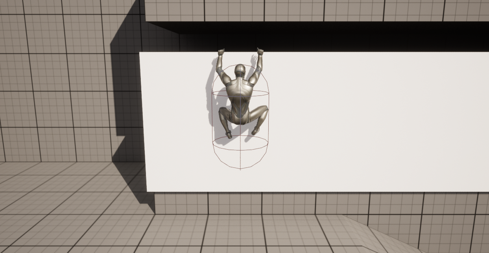
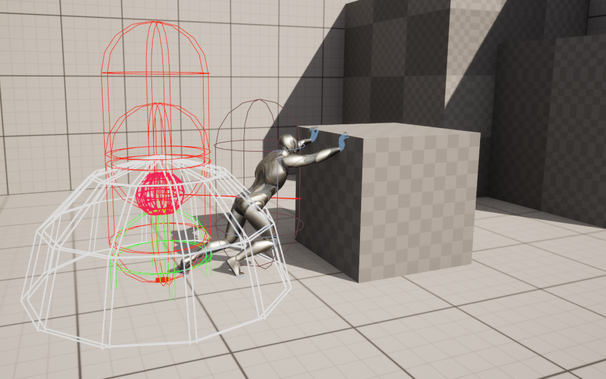
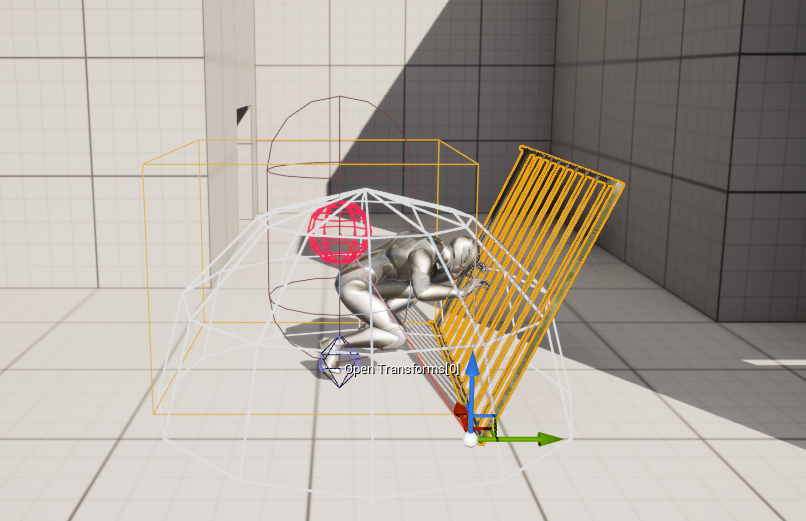

<h1 align="center">Animal Soul</h1>

A project in UE5 using Blueprint programming

 

     
    
    
    
    
    

 

    <a href="#-about-the-project">About the project</a> •
    <a href="#-license">License</a> •
    <a href="#-contact">Contact</a> 

## 💻 About the project

For this project, I chose a Sidescroller type of gameplay with the possibility of moving in the depth axis as well.

I modified a third-person Unreal standard project to best suit the proposed movement and added some other tricks such as roll and crouch movements.

I created a climbing system from scratch, which allows the player to climb objects, move while hanging on a ledge, jump from ledge to ledge and turn in a corned ledge.

I also created a blueprint for "pushable" objects and "openable" objects, making both as customized as possible to make building a level an easier process.

All animations were retarget from mixamo animations to the Unreal 5 sckeleton.
 

#### Climb System

#### Push Objects

#### Open Objects

 

### Built with
Apart Unreal Engine 5, I used the following tools to build this project.

- [VisualStudio 2022][visualstudio]

## 📃 License

Distributed under the MIT License. See [LICENSE](./LICENSE) for more information.

## 🌟 Contact

Hey :D

If you wanna get in touch, fell free to contact me at:

[LinkedIn][linkedin]

---

Made by Venicio Augusto 

<!-- LINKS-->

[visualstudio]: https://visualstudio.microsoft.com/vs/
[mysql]: https://www.mysql.com/

[linkedin]: https://www.linkedin.com/in/venicio-augusto/